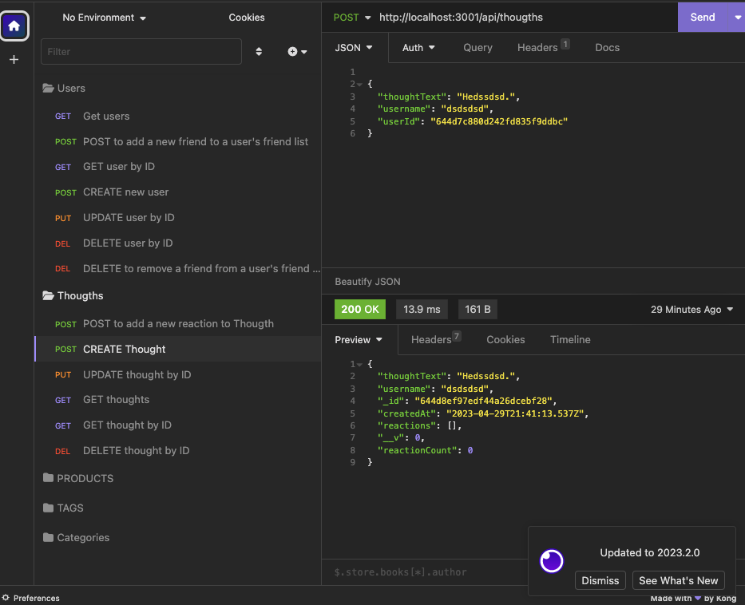
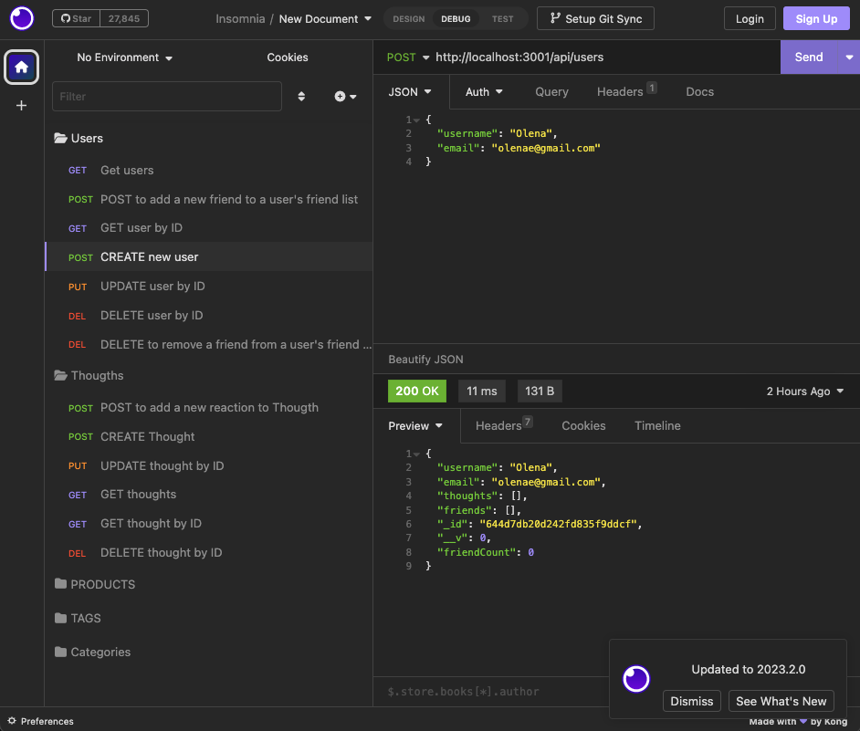

# Social Media Startup API

[](https://opensource.org/licenses/MIT)

## Description

This API has been developed to support a social media startup that uses a NoSQL database to store large amounts of unstructured data. The API allows users to interact with the social network by creating, updating, and deleting user accounts, thoughts, and reactions.

## Getting Started

Be sure to have MongoDB installed on your machine. Follow the [MongoDB installation guide on The Full-Stack Blog](https://coding-boot-camp.github.io/full-stack/mongodb/how-to-install-mongodb) to install MongoDB locally.


## Installation and Setup

> 1. Clone the repository to your local machine.
> 2. Install Node.js and MongoDB if they are not already installed on your machine.
> 3. Run npm install to install all the dependencies.
> 4. Create a .env file in the root directory of the project and add the following variables:

```
MONGODB_URI=mongodb://localhost:27017/social-media-startup
PORT=3001

```
> 5. Start the server by running `npm start`


## API Endpoints

   ###  `User Routes`
  

`GET `/api/users
Displays all users in the database.

`GET` /api/users/:id
Displays a single user by ID.

`POST` /api/users
Creates a new user.

`PUT` /api/users/:id
Updates an existing user by ID.

`DELETE` /api/users/:id
Deletes a user by ID.

  ### `Thought Routes`

`GET` /api/thoughts
Displays all thoughts in the database.

`GET` /api/thoughts/:id
Displays a single thought by ID.

`POST` /api/thoughts
Creates a new thought.

`PUT` /api/thoughts/:id
Updates an existing thought by ID.

`DELETE` /api/thoughts/:id
Deletes a thought by ID.

  ### `Reaction Routes`

`POST` /api/thoughts/:thoughtId/reactions
Creates a new reaction to a thought by ID.

`DELETE` /api/thoughts/:thoughtId/reactions/:reactionId
Deletes a reaction to a thought by ID.

  ### `Friend Routes`

`POST` /api/users/:userId/friends/:friendId
Adds a friend to a user's friend list by ID.

`DELETE` /api/users/:userId/friends/:friendId
Removes a friend from a user's friend list by ID.

## Acceptance Criteria

* When the command to invoke the application is entered, the server is started and the Mongoose models are synced to the MongoDB database.
* When the API GET routes for users and thoughts are opened in Insomnia, the data for each of these routes is displayed in a formatted JSON.
* When the API POST, PUT, and DELETE routes for users and thoughts are tested in Insomnia, the user and thought data is successfully created, updated, and deleted in the database.
* When the API POST and DELETE routes for reactions and friend lists are tested in Insomnia, reactions are successfully created and deleted for thoughts, and friends are successfully added and removed from a user's friend list.


## Models

Use the following guidelines to set up your models and API routes:

**User**:

* `username`
  * String
  * Unique
  * Required
  * Trimmed

* `email`
  * String
  * Required
  * Unique
  * Must match a valid email address (look into Mongoose's matching validation)

* `thoughts`
  * Array of `_id` values referencing the `Thought` model

* `friends`
  * Array of `_id` values referencing the `User` model (self-reference)

**Schema Settings**:

Create a virtual called `friendCount` that retrieves the length of the user's `friends` array field on query.

---

**Thought**:

* `thoughtText`
  * String
  * Required
  * Must be between 1 and 280 characters

* `createdAt`
  * Date
  * Set default value to the current timestamp
  * Use a getter method to format the timestamp on query

* `username` (The user that created this thought)
  * String
  * Required

* `reactions` (These are like replies)
  * Array of nested documents created with the `reactionSchema`

**Schema Settings**:

Create a virtual called `reactionCount` that retrieves the length of the thought's `reactions` array field on query.

---

**Reaction** (SCHEMA ONLY)

* `reactionId`
  * Use Mongoose's ObjectId data type
  * Default value is set to a new ObjectId

* `reactionBody`
  * String
  * Required
  * 280 character maximum

* `username`
  * String
  * Required

* `createdAt`
  * Date
  * Set default value to the current timestamp
  * Use a getter method to format the timestamp on query

**Schema Settings**:

This will not be a model, but rather will be used as the `reaction` field's subdocument schema in the `Thought` model.

### API Routes

**`/api/users`**

* `GET` all users

* `GET` a single user by its `_id` and populated thought and friend data

* `POST` a new user:

```json
// example data
{
  "username": "lernantino",
  "email": "lernantino@gmail.com"
}
```

* `PUT` to update a user by its `_id`

* `DELETE` to remove user by its `_id`

---

**`/api/users/:userId/friends/:friendId`**

* `POST` to add a new friend to a user's friend list

* `DELETE` to remove a friend from a user's friend list

---

**`/api/thoughts`**

* `GET` to get all thoughts

* `GET` to get a single thought by its `_id`

* `POST` to create a new thought (don't forget to push the created thought's `_id` to the associated user's `thoughts` array field)

```json
// example data
{
  "thoughtText": "Here's a cool thought...",
  "username": "lernantino",
  "userId": "5edff358a0fcb779aa7b118b"
}
```

* `PUT` to update a thought by its `_id`

* `DELETE` to remove a thought by its `_id`

---

**`/api/thoughts/:thoughtId/reactions`**

* `POST` to create a reaction stored in a single thought's `reactions` array field

* `DELETE` to pull and remove a reaction by the reaction's `reactionId` value

## Screenshots



## Contributing

Contributing
Contributions are welcome! If you would like to contribute to this project, please fork the repository and submit a pull request.

## Support

- [MDN](https://developer.mozilla.org/en-US/) 

- [Google](https://Google.com)


## Questions

If you have any questions about this project, please feel free to reach out to me:
  
- [Contact - Full Stack Coder - Iaroslav Lasiichuk](mailto:lasiichuki@gmail.com)